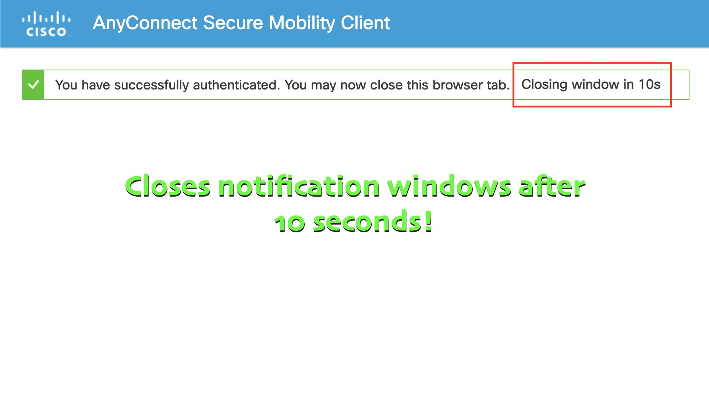

# Clocisco
A tiny browser extension which closes Cisco Secure Client browser window notifications after 10 seconds.

### Installing
From the Chrome web store, install and enable the extension.  

That's it.